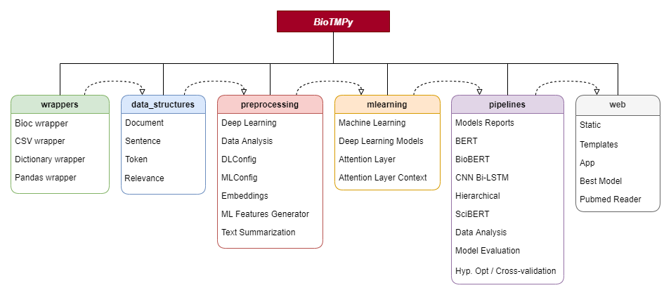

# BioTMPy - Biomedical Text Mining with Python

## Description
This package was developed to ease the process of creating a pipeline to perform Document Classification using machine learning models, with a special focus on deep learning. This way, by using BioTMPy, one can retrieve the most relevant documents for a given topic.

## Installation
```bash
git clone https://github.com/BioSystemsUM/biotmpy.git
```
## Requirements
To use BioTMPy you first need to install either [Anaconda](https://www.anaconda.com/products/individual) or [Miniconda](https://docs.conda.io/en/latest/miniconda.html), and then create a conda environment with the "conda_environment.yml" file. This file will allow you to install the packages required to use all the available features of this tool (Note: The Tensorflow version used in this environment supports computations on one or more GPUs). 
```bash
cd biotmpy
#Windows
conda env create -f conda_environment_win.yml
#Linux
conda env create -f conda_environment_lin.yml

conda enable biotmpygpu
```

## Detailed Description
To provide the required steps for the development of a complete pipeline for document relevance, BioTMPy is divided into 6 main modules that can be used separately:
- **Wrappers** - convert data from distinct formats (.xml-bioc,.csv, dictionary) to a pandas dataframe using data structures

- **Data Structures** (data_structures) - data structures for document, sentences, tokens and relevance associated to a certain document

- **Preprocessing** - methods to perform preprocessing for Deep Learning(DL) models, feature generation (used on tradicional Machine Learning) and data analysis. Additionally, it contains config structures to choose some preprocessing steps like stop words removal, stemming, etc., containing also attributes to save the models and the results obtained throughout the pipeline.

- **Machine Learning** (mlearning) - module that provides different DL models and some methods to train/predict/evaluate traditional Machine Learning models from [scikit-learn](https://scikit-learn.org/stable/#).

- **Pipelines** - examples of complete pipelines to train/evaluate DL models, perform hyperparameter optimization and cross-validation.

- **Web** - module provides an easy implementation of a web service to deploy the developed model. Also, with the "pubmed_reader.py" file, it is possible to retrieve documents from the PubMed database, by using a term or PubMed IDs, and convert them into document objects.




## Contacts
If you have any questions, feel free to send an email to n4lv3s@gmail.com


